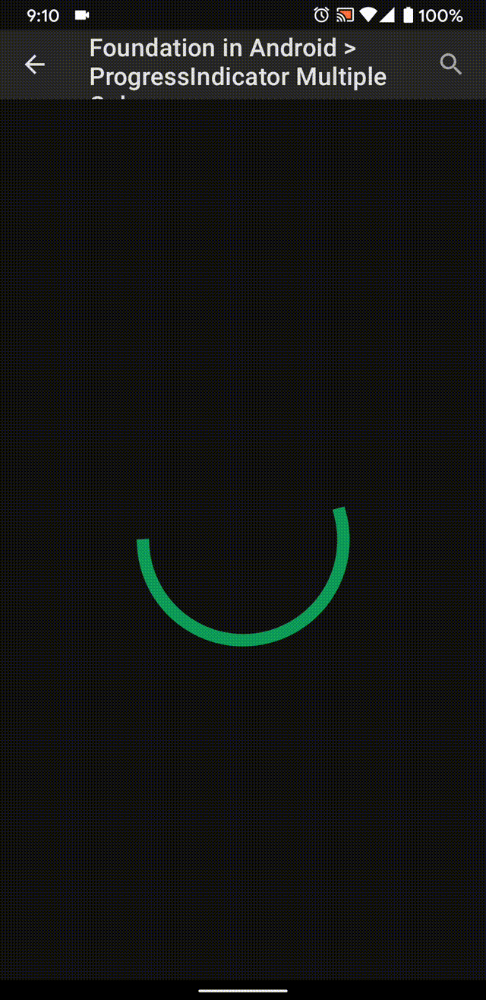
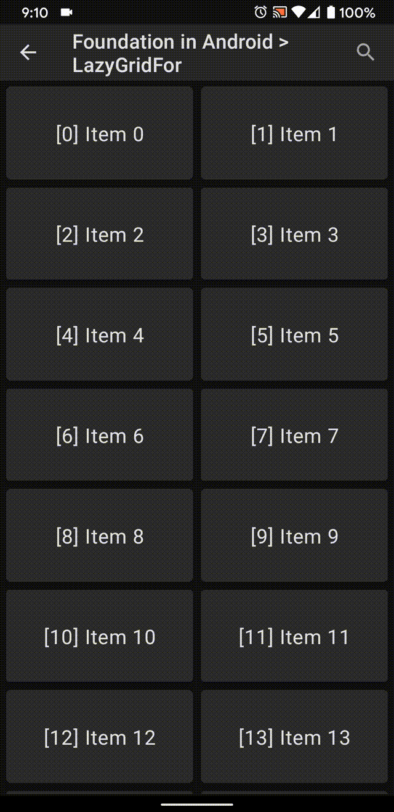

# Android Jetpack Compose Sample

### Base Architecture

- androidx/compose : https://github.com/androidx/androidx/tree/androidx-master-dev/compose/integration-tests/demos

## Sample

Foundation

| Sample                              | Content                                                      | Preview                                                      |
| ----------------------------------- | ------------------------------------------------------------ | ------------------------------------------------------------ |
| Multiple-color in ProgressIndicator | Origin Source : https://cs.android.com/androidx/platform/frameworks/support/+/androidx-master-dev:compose/material/material/src/commonMain/kotlin/androidx/compose/material/ProgressIndicator.kt |  |
| LazyGridFor                         | Original Source : https://proandroiddev.com/android-jetpack-compose-exploring-state-based-ui-e1d970471d0a |            |

Modifier

- DrawLayer Demo
  - Original Source : https://gist.github.com/zach-klippenstein/e2c8e6edf0d950d8ba527cd0681c5b60
  - Migration, Compose last version